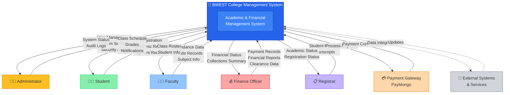

# Context Diagram - BWEST College Management System

## High-Level System Boundary and External Entities

This diagram shows the system boundary and all external entities that interact with the BWEST College Management System.

## Key External Entities

| Entity | Role | Primary Functions |
|--------|------|-------------------|
| **Administrator** | System Manager | User management, system configuration, security audits, reporting |
| **Student** | User | Registration, view schedules, track grades, make payments, manage clearance |
| **Faculty** | Content Provider | Record attendance, submit grades, manage class rosters, view student info |
| **Finance Officer** | Financial Manager | Process payments, generate financial reports, manage clearance, collect fees |
| **Registrar** | Academic Records | Maintain student records, manage transcripts, process registrations |
| **Payment Gateway** | External Service | Process online payments securely (PayMongo integration) |
| **External Systems** | Third-party Integration | Future integrations for data exchange |

## System Responsibilities

The BWEST College Management System provides:
- **Academic Management**: Class scheduling, attendance, grades, transcripts
- **Financial Management**: Payment processing, fee management, financial reports
- **User Management**: Role-based access, authentication, authorization
- **Registration**: Student enrollment, course registration, academic planning
- **Notifications**: Real-time alerts for grades, payments, schedule changes
- **Reporting**: Analytics, audit logs, compliance reports
