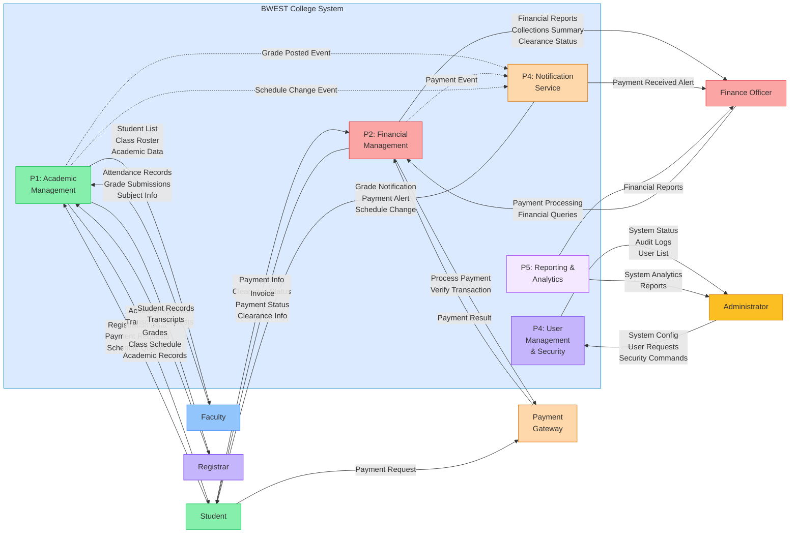
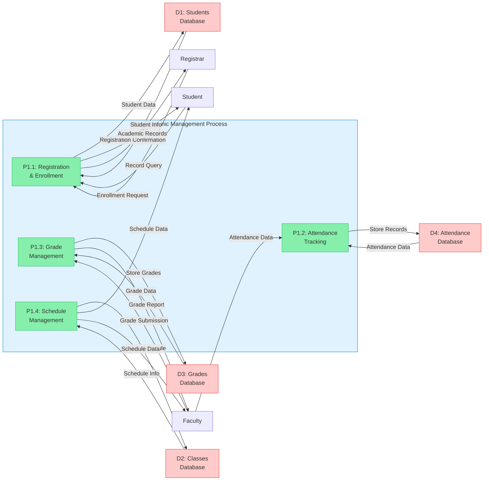
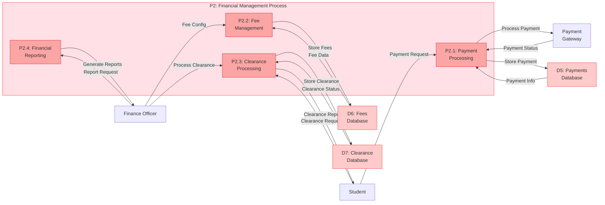

# Data Flow Diagram (DFD) - BWEST College Management System

## Level 0 - System-Level Data Flows

This diagram shows how data flows between external entities and the main processes within the system.

## Level 1 - Detailed Academic Management Process (P1)

## Level 1 - Detailed Financial Management Process (P2)

## Data Stores (Databases)

| ID | Name | Purpose | Primary Data |
|----|------|---------|--------------|
| **D1** | Students | Student information & profile | ID, Name, Email, Program, Status |
| **D2** | Classes | Course/Class information | Class ID, Name, Faculty, Schedule |
| **D3** | Grades | Student grades & academic records | Student ID, Class ID, Grade, Status |
| **D4** | Attendance | Attendance records | Student ID, Class ID, Date, Status |
| **D5** | Payments | Payment transaction records | Payment ID, Student ID, Amount, Status, Date |
| **D6** | Fees | Fee structure & assessment | Fee ID, Student ID, Amount, Type, Deadline |
| **D7** | Clearance | Student clearance status | Clearance ID, Student ID, Status, Sign-offs |
| **D8** | Users | Authentication & Authorization | User ID, Email, Password Hash, Role |
| **D9** | Notifications | Notification records & delivery | Notification ID, User ID, Type, Message, Read Status |

## Data Flow Summary

- **Students**: Submit registrations, payment requests, and clearance queries
- **Faculty**: Submit grades and attendance records
- **Finance**: Process payments and manage clearances
- **Admin**: Configure system and manage users
- **Registrar**: Access academic records and transcripts
- **Notifications**: Automatically triggered from grade, payment, and schedule changes
